# HIV Prevention Design {#hiv-prev-design}

## Introduction

The prevention component of the **DHIS2 Toolkit for HIV** is based on the latest WHO Consolidated guidelines on person-centred HIV strategic information: strengthening routine data for impact [https://www.who.int/publications/i/item/9789240055315](https://www.who.int/publications/i/item/9789240055315) (2022) and the Digital adaptation kit for HIV: operational requirements for implementing WHO recommendations and standards within digital systems, second edition.

This toolkit includes

- WHO-recommended dashboard analyses and core indicators for monitoring HIV prevention initiatives and using key metrics to adjust programming & drive impact
- DHIS2 Tracker program aligned with the WHO Digital Adaptation Kit data standards for individual level data collection and operational person-centred monitoring at facility and community levels
- Aggregate data sets and data elements to model aggregated tracker data for performant, anonymized analytics
- Data exchange mapping for aggregating DHIS2 tracker data for prevention indicators and integration of key indicators with national HMIS

The HIV toolkit is optimised for improving strategic information systems in countries to facilitate data-driven decision-making, as well as streamlining routine data management processes. The DHIS2 HIV prevention tracker is *not* designed to provide clinical decision-support for prevention services, but rather serves as an operational tool and a source of individual level data for person-centred monitoring.

The system design document explains the reference configuration in DHIS2 for the HIV prevention use case, including a detailed description of DHIS2 Tracker configuration, dashboard design, use of program indicators, mapping of tracker data to the aggregate data model, and data exchange mechanisms. This document also does not consider the resources and infrastructure needed to implement such a system, such as servers, power, internet connections, backups, training and user support, which can be found in the [DHIS2 Tracker Implementation Guide](https://docs.dhis2.org/en/implement/tracker-implementation/target-audience.html).

Reference metadata for this toolkit is available at: [dhis2.org/metadata-downloads](https://dhis2.org/metadata-downloads/).

### Acknowledgements

The HIV prevention toolkit has been developed in partnership with the WHO Global HIV Programme and the Pan American Health Organization (PAHO) with support from The Global Fund. We are grateful to WHO and PAHO for providing subject matter expertise in the design and development of these tools, as well as to the many countries who have shared their implementation experience with us.

## System design overview

### Background

Efforts to end the HIV epidemic by 2030 face persistent challenges, with 1.5 million new infections in 2020 alone. Key populations and their sexual partners constituted 70% of global new infections in 2021 (UNAIDS, 2022), highlighting barriers to equitable access. Paramount importance is to emphasise routine programmatic data for tracking service delivery, identifying at-risk individuals, and achieving universal access through a person-centred approach. Confidentiality and data privacy is crucial, especially for vulnerable populations that may be stigmatised, necessitating a cautious approach to individual-level data collection and anonymization for data use needs above the service delivery level.

A person-centered monitoring approach offers distinct advantages for longitudinal HIV data collection that can track and record prevention services provided to an individual over time and space (e.g. different service delivery sites and touchpoints with prevention programmes). Scaling up individual level data collection allows for flexible disaggregation and enhanced analysis by various factors such as time, location, age, gender, those at elevated risk of HIV acquisition, key population, linkage to services and more. This depth of information enhances our understanding of HIV epidemiology and facilitates ongoing monitoring of trends. Implementation of case-based electronic data is anticipated to enhance data quality by minimising data entry steps, integrating automatic calculations and validations, swiftly correcting or completing inconsistent or incomplete individual records, and facilitating de-duplication.

However, in most LMICs, the digitization of individual-level data systems managed by Ministries of Health often takes years to reach scale, and must be matched by substantial in-country resources to sustain the system over time. At the same time, implementing partners such as iNGOs and civil society also play a role in delivering HIV prevention services and may use their own digital tools for data collection and management. Furthermore, historical data and other programmatic data are often collected or represented through the aggregate data model – such as denominators based on Spectrum estimates for people living with HIV and aggregated reporting from paper-based service delivery sites with low/no connectivity, limited availability of devices and/or weak infrastructure.

Therefore, the HIV prevention toolkit leverages all DHIS2 applications and data models to support practical, implementable approaches to collecting, analysing and using HIV prevention data effectively to prevent HIV infections and link newly identified HIV cases into treatment programs and national HIV case surveillance systems. These tools can be used in a modular way to meet the needs of any country along the maturity model for digitization of health data – including hybrid implementation of paper-based and digitized systems, as well as incorporating data from other electronic tools like hospital EMRs where these may be used.

### Use Case

The HIV Prevention toolkit is designed to support routine data collection for programmes that support people identified as at-risk for HIV infection to enroll in a prevention program and receive HIV prevention services. The system is designed to bring data together to generate granular HIV prevention indicators and their disaggregations for routine data analysis, person-centered monitoring and strategic information through flexible dashboards and ad-hoc analysis with DHIS2 analytics tools.

The data capture components of the system design allows for staff at service delivery sites, or higher levels depending on local contexts, to capture the core data elements during routine interactions with prevention programme participants that will allow HIV programme staff to generate key performance indicators as detailed in WHO’s *Consolidated guidelines for person-centred HIV strategic information* (WHO, 2022). This component uses the DHIS2 Tracker data model. While DHIS2 HIV prevention tracker program is not optimized to support clinical case management or decision support, it serves as a useful electronic registry that supports decentralised electronic data capture of HIV prevention data down to health facility or any other point of service from all types of actors. Individual level tracker data are aggregated using DHIS2 program indicators; which are mapped to aggregate data elements and data sets for populating core indicators and serving the analytical dashboards with anonymized data.

The DHIS2 tracker program structure has been harmonised and follows the same logic as the HIV Case Surveillance Tracker, allowing for a person enrolled in a prevention program to enter the case surveillance program with a positive HIV diagnosis. In some contexts, it may be desirable to integrate prevention and case surveillance into a single tracker program. Harmonization of data elements between the two trackers will allow for local adaptation and integration, described further in the ‘Implement’ section of this document.

#### Intended users

The HIV prevention system design focuses on meeting the needs of end users at all levels of the health system, including those responsible for implementing HIV prevention programmes in countries. These users may include:

- **HIV program managers & staff (national & sub-national):** data users who are responsible for routine analysis of data, using data to improve operations and programme strategies, and providing data-driven feedback to programme staff, including implementing partners, facilities, and other service delivery points
- **HIV programme data managers**: users who are responsible for overseeing data collection, management, data quality, analysis and reporting functions for the national HIV programme
- **System admins/HMIS focal points**: MOH staff and/or core DHIS2 team responsible for maintaining and improving data systems for health programmes, integrating data streams into national platforms, providing technical support for system design, adaptation and end user support; and maintaining the DHIS2 system over time
- **Service delivery sites:** Staff at service delivery sites may use the DHIS2 Tracker program to record data for routine visits with prevention clients, as well as use DHIS2 tools like working lists and line-list to follow up with clients and monitor individual-level uptake of services. 
- **Implementing partners**: organizations who provide technical assistance to the national HIV programme, collect and analyze data on behalf of the overall national programme strategy, and may be responsible for the operations of service delivery networks such as HIV counseling, educational outreach, community health workers.

### Design Structure

The DHIS2 HIV Prevention configuration is structured in three major components:

- **Dashboards & Indicators:** the HIV prevention dashboards and indicators are all served by the aggregate data model in DHIS2. Prevention dashboards are shared with the HIV HMIS module. 
- **Aggregate data sets:** aggregate datasets, data elements and associated category combinations are configured according to the WHO’s HIV analysis framework to populate the core indicators. Three datasets are designed to receive aggregated tracker data (e.g. via program indicators) and model this data in a performant way, leveraging the advantages of the aggregate data model in DHIS2 for analysis. Alternatively, these datasets can also be used for aggregate paper-based reporting; or to store data reported routinely from other individual-level data systems in use, such as sites using EMRs or other mobile applications. 
  - HIV prevention (monthly)
  - HIV prevention (yearly)
  - Population estimates
- **Tracker program**: a DHIS2 tracker program has been configured for individual-level, longitudinal data collection. The tracker program can be used with the DHIS2 web or Android clients.

These modular components are designed based on the heterogeneous nature of HIV data systems in countries and support the typical architecture for implementing case-based data systems alongside integrated national HMIS infrastructure:

## Tracker

### Tracker Program Structure

The tracker program structure is as follows:

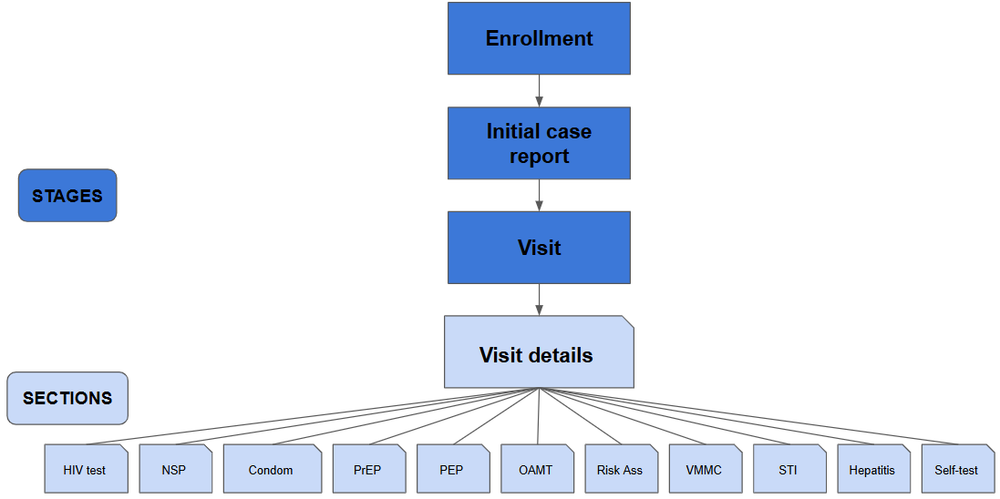

| **Stage**           | **Description**                                              |
| ------------------- | ------------------------------------------------------------ |
| Enrollment          | The enrollment stage collects the basic demographic data about a person, including unique identifiers, as Tracked Entity Attributes (TEAs). Several of these core TEAs such as Family Name and Given name are shared across DHIS2 Tracker programs.  The Tracked Entity Type for the HIV Prevention program is ‘Person’.  **The stage is non-repeatable.** |
| Initial case report | The stage can be filled at the same time as the enrollment of the patient.This stage contains the information related to key population groups. **The stage is non-repeatable.** |
| Visit               | Main stage that collects all the information necessary for the follow-up of the patient and the program. **The stage is repeatable** |

### Tracked Entity Type

The DHIS2 HIV Prevention tracker program allows for the enrollment of a tracked entity type [TET] ‘person’ into the HIV prevention program. The TET type is shared with the HIV Case Surveillance tracker to allow enrollment of the same TEI in both programs, in the case that a person receiving prevention services receives a positive HIV diagnosis.

### Enrollment

It is assumed that the HIV prevention workflow begins by enrolling any person identified at risk for HIV infection with an *unknown HIV status* or *known HIV negative status*. Persons presenting with a known HIV positive status should be enrolled into the HIV Case Surveillance Tracker program.

When a person is enrolled in the HIV Prevention program as a Tracked Entity Instance (TEI), Tracked Entity Attributes (TEA) are recorded to form the case profile. All TEAs are aligned and harmonised with those included in the HIV Case surveillance tracker allowing for enrollment in both programs or for integration into a single tracker program if desired at the local implementation level. Note that several TEAs are shared across non-HIV DHIS2 Tracker programs; these are configured with a prefix ‘GEN’ (general) to indicate they are shared between tracker programs. Check out the [Common Metadata Library](https://docs.dhis2.org/en/topics/metadata/dhis2-who-digital-health-data-toolkit/common-metadata-library/design.html) for more information on shared tracker metadata.

The TEA **program UID** attribute refers to an HIV program specific identifier. It has been kept intentionally blank as coding processes are dependent on local context. Refer to the [DHIS2 User Documentation on configuring system-wide unique identifiers as DHIS2 TEAs](https://docs.dhis2.org/en/use/user-guides/dhis-core-version-238/configuring-the-system/programs.html#configure_tracked_entity). The use of anonymous UID codes allows individuals accessing HIV prevention services to be uniquely identified and followed longitudinally, without the collection of other types of personally identifying information (WHO, 2022).

The **date of birth and age** can be assigned in two different ways:

- Known date of birth: select the Date of birth
- Unknown date of birth: select the Date of birth - Unknown option and then enter the age either in years or months.

Once done, a 'probable' age of birth is assigned to the Date of birth based on the value entered either on the years or month TEA.

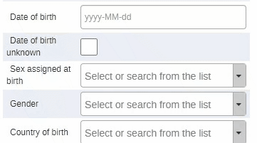

>**Note:** 
>
>The date of birth is configured as mandatory; it must always have a value because it is used in the calculation of all program indicators involving age groups

### Stage 1: Initial case report (non-repeatable)

The data acquired at this stage pertains to the identification of clients belonging to one or multiple key population groups. We recommend implementations to refer to WHO’s 2022 *Consolidated guidelines on person-centred HIV strategic information*, and specifically sections 2.2.2 for guidance on collecting information on key populations for prevention interventions to allow for this disaggregation, further considerations in section 5.1.1, and section 6.4 on maintaining data privacy, security and confidentiality as it relates to key population data captured.

Key population data is collected as a program stage in order to further protect the sensitive nature of this data. Specifically, by including this data only in the program stage, it is not accessible for searching a TEI – where users may have broader access to search for clients.

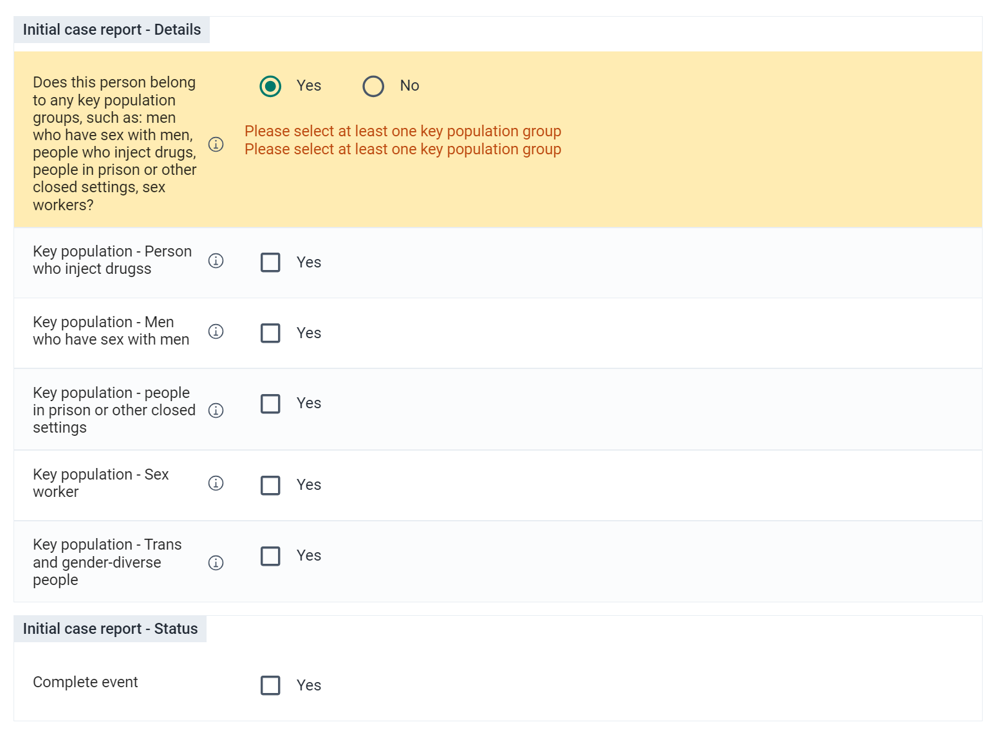

In some implementations, instead of having the different key population groups listed as selectable categories, a set of questions has been proposed and according to the answer a key population identification is assigned to the clients. *See the section Implementation Considerations & Local Adaptation*.

For an individual enrolled in an HIV prevention program, it is possible that their association with a key population group may change over time, as an individual’s risk of HIV acquisition, participation in high risk behaviours, and HIV prevention needs vary over time. The program stage is intentionally designed as non-repeatable to allow optimized analytics based on the key population group. However, a user may revisit this stage and modify the key population groups as needed. 

When using data from this program stage to derive denominators for individuals at risk or in need of HIV prevention, inclusion criteria should be considered when the data on prevention need were collected. Data collected in the past may not reflect current need for prevention interventions; information collected within the last three to six months is more likely to be pertinent (WHO, 2022). See section 2.2.5 of WHO’s 2022 *Consolidated guidelines on person-centred HIV strategic information guidelines* (WHO, 2022) for more information.

### Stage 2: Visit [repeatable]

#### Configuration of Dates

This repeatable program stage captures all information relevant to visits/encounters for the person receiving prevention services, regardless of which type of service they access. It allows for capturing multiple types of services provided in a visit. This is integral for a comprehensive, person-centred management and reporting system.

In this program stage, the DHIS2 program ‘event date’ (or default ‘report date’ in the Maintenance app for program configuration) has been renamed to represent ‘Visit date.’ This means that all analytics based on the event date will evaluate based on the date of the person’s encounter (visit) with the prevention service provider.

In addition to the visit date, additional key dates have been configured as Tracker domain data elements related to these activities (e.g., HIV test date, STI test date, etc.) and these should be reported to enable additional time-based analytics.

#### Visit details

The initial Visit Details section allows the user to select which prevention services will be recorded for this visit report. A series of program rules will show/hide the desired sections depending on which type of prevention details will be recorded. It is generally assumed that the user will create a new Event in the Visit stage for each time they interact with a service provider, regardless of how many prevention services they access during the visit.

The data element representing VMMC services will only show for persons enrolled with TEA ‘Sex assigned at birth’ as ‘Male’ or ‘Other’, based on program rules.

>**Note:**
>
>Hiding a section does not erase the data that are recorded there and all the program indicators are NOT filtered by the selection or not of the section. In case there are any data that has been mistakenly entered, they will need to be removed manually one by one and not simply de-selecting the section

#### Risk assessment

The risk assessment section contains a set of questions designed to ascertain whether the client is at elevated risk for HIV acquisition. If any of these questions are answered with a "Yes," the TEI will be classified as ‘at elevated risk for HIV acquisition’. The questions within the risk assessment section constitute one component utilised to evaluate the existence of elevated risk. The comprehensive list of metadata employed in defining those at elevated risk can be found here.

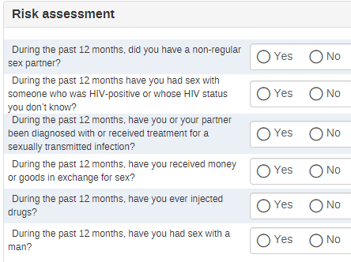

These questions are one example of establishing an individual’s risk of acquiring HIV following an HIV-negative test (see Box 2.3 within WHO SI 2022 guidelines) in order to prioritize follow-up through appropriate prevention services. It is expected that the risk assessment section may be adapted to country context. Since an individual’s risk of HIV acquisition and HIV prevention needs vary over time, it is important to record the date that any information on risk differentiation was collected and to consider this when assessing an individual’s likely current prevention needs. When deriving indicator denominators for individuals at risk or in need of HIV prevention, inclusion criteria should consider when the data on prevention need were collected. The WHO guidelines note that data collected in the past may not reflect *current* need for prevention interventions; whereas information collected within the last three to six months is more likely to be pertinent. Therefore, is is most appropriate to include this section in a repeatable program stage where an individual’s risk can be re-assessed over time.

#### Condoms

This section contains key information related to the type and quantity of condoms distributed to individuals enrolled in prevention programs. Note that due to its inclusion within a Tracker program targeting a cohort of individuals enrolling in prevention services, this section does *not* inherently account for condoms distributed through other channels, such as campaigns or private sector commodity distribution points. It is assumed here that the date of condom distribution is the same as the ‘Visit Date’ (DHIS2 event date).

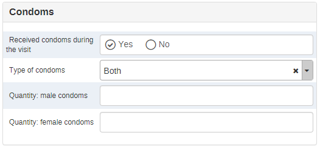

#### HIV test

In this section, all information regarding HIV testing with details required for disaggregation of HIV testing service indicators are included. 

Note that a positive HIV test result does not necessarily confirm an HIV case during real-world country implementation; each country may use their own algorithms for confirming an HIV case based on one or more test results. This section may be adapted to capture additional information on the number, type and sequencing of HIV tests provided. Please also ensure that program indicator definitions are updated according to country context for confirming an HIV positive case that was enrolled in the HIV prevention program.

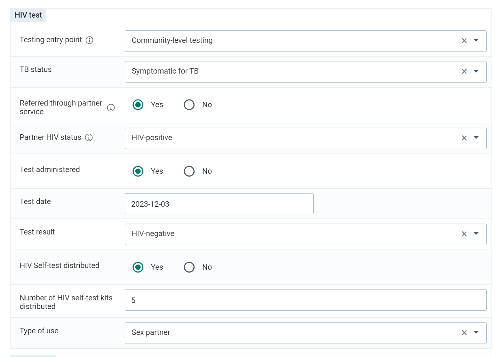

#### PrEP

Within the PrEP (HIV Pre-exposure Prophylaxis) section, information related to PrEP usage, adverse effects and the delivery/administration of PrEP are requested.

The option sets assigned to the Data Element **Specify adverse effect** have been kept generic, l as these options are intended to be configured within the context of the implementation. These will need to be customised prior to implementation.

#### PEP

Within the PEP (Post Exposure Prophylaxis) section, basic information related to initiation of post-exposure prophylaxis and the HIV exposure type are requested. It is expected that PEP follow-up visits are recorded during repeated events. Program rules have been configured to calculate and assign the next scheduled PEP visit 28 days following the initiation of PEP, in accordance with the WHO recommendations. This is represented by the ‘due date’ in DHIS2 tracker. 

#### NSP

Within the Needle-Syringe Program (NSP) section, basic information on access to NSP services and needle-syringes received by the client are requested

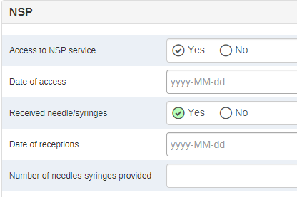

#### OAMT

Within the Opioid Agonist Maintenance Treatment (OAMT) section, information related to the status of the OAMT treatment, doses administered, maintenance doses and multiple dose dispensing are collected.

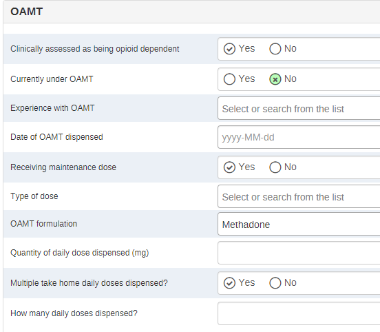

#### VMMC

In the Voluntary Medical Male Circumcision (VMMC) section, information related to the procedure performed and any adverse event experienced are collected.

The data element **VMMC** in the Visit details section is visible only for the TEI that has selected “Male” or “Other” option in the TEA **Sex assigned at birth.**

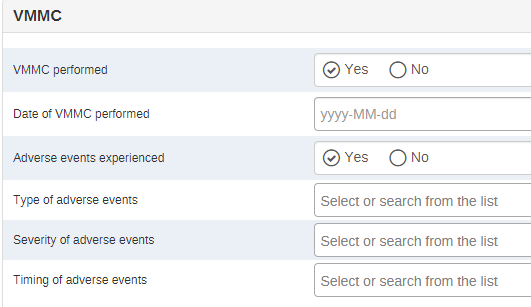

#### STI

In the Sexually Transmitted Infections (STI) section, information related to the STI syndrome diagnosed, STI test performed and treatment administered are collected among clients enrolled in the HIV prevention program.

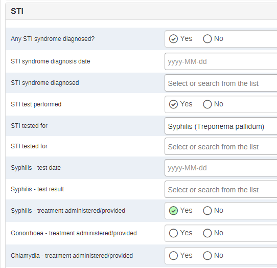

#### Viral hepatitis

In the Viral hepatitis section, information related to HBsAG and HCV tests performed and test results are collected among clients enrolled in the HIV prevention program.

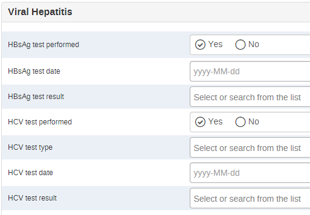

### Tracker Data Elements

All data elements configured for the Tracker domain are also included in the Data Element Group ‘HIV prevention (tracker)’ [Mx8yzdlahth]. This serves as a de facto DHIS2 data dictionary for the HIV prevention tracker use case. It allows for the data elements to be exported from DHIS2 and used independently of the Tracker program configuration, for example in the case that an implementation redesigns their Tracker from scratch for local workflows and still wants to maintain compliance with the core WHO-recommended data dictionary included in the Digital Adaptation Kit.

#### Cloned data elements for multiple option selection

Within the repeatable program stagefor ‘Visits’, there are a number of data elements that are cloned to allow the selection of multiple options for a given concept, sharing the same option set. This design is implemented as follows:

- Cloning of data elements eligible for multi-option choice
  - The number of clone of the data element must be the same as the number of options present in the related option set
  - Each cloned data element has its own UID, name and code
- Program Rules
  - Hide the consequent Data Elements if the previous have not been selected
  - Show error in case the same Option has been selected more than once in the same group of Data Elements

For example, to capture multiple STI syndromes diagnosed, there are a series of data elements that are cloned to represent each discrete diagnosis: 

- HIV - STI syndrome diagnosed - 1 [HSzzcPJpA6I]
- HIV - STI syndrome diagnosed - 2 [D4IIo7OwOXb]
- HIV - STI syndrome diagnosed - 3 [c1e15eg6ddB]
- HIV - STI syndrome diagnosed - 4 [BE7dAhKw3bl]

#### Hidden Data Elements & Assigned Values to Data Elements

All the Data Elements mentioned hereunder are “hidden” and therefore not visible during the data entry process; however they are required for the calculation of program indicators.

Here we provide an overview of all the “hidden” data elements which are contained in the repeatable Visit stage, where program rules are used to assign a value. In many cases, the program rule simply assigns a value from a previous program stage (such as Initial Report) in order to allow the program indicators to calculate correctly.

**Assigning key population data element value to Visit Stage**

Program rules are used to copy and assign the value of the TEI’s key population group recorded in the initial case report to a hidden data element field on the repeatable ‘Visit’ program stage. This allows for all calculations and disaggregations based on key population group to be configured namely by using the autoassigned data element as a filter in the program indicator.

These Data Elements are identified with the postfix “- VISIT” and are the ones used for all program indicators that filter by a key population group: 

| **Metadata** | **UID**     | **Name**                                                 |
| ------------ | ----------- | -------------------------------------------------------- |
| Data Element | OF0nynhdcwZ | HIV - Key population - Injection drug user - VISIT       |
| Data Element | qYfitZEUOAb | HIV - Key population - Men who have sex with men - VISIT |
| Data Element | Eu3UmwQ1EUO | HIV - Key population - Prisoner - VISIT                  |
| Data Element | KM0Zn4zYUwa | HIV - Key population - Sex worker - VISIT                |
| Data Element | A57Hv80XrzD | HIV - Key population - Transgender - VISIT               |
| Program Rule | em8GjAu2wZY | HIV - Assign true value to Injection drug user           |
| Program Rule | NIL9zQMI3bS | HIV - Assign true value to Men who have sex with men     |
| Program Rule | iIvwL5mWU7s | HIV - Assign true value to Prisoner                      |
| Program Rule | TFF0E0N9MrO | HIV - Assign true value to Sex worker                    |
| Program Rule | ZzdKaWHJiZp | HIV - Assign true value to Transgender                   |
| Program Rule | JQU9DwfMlxt | HIV - Assign false value to Injection drug user          |
| Program Rule | nQk50JoDdpg | HIV - Assign false value to Men who have sex with men    |
| Program Rule | hmrzByEYkOz | HIV - Assign false value to Prisoner                     |
| Program Rule | Ac3UWsrP943 | HIV - Assign false value to Sex worker                   |
| Program Rule | O9WsIRxxS4Y | HIV - Assign false value to Transgender                  |

**Calculating & Assigning Substantial Risk** 

The denominators for several WHO SI coverage indicators should count all the clients that have tested HIV negative and that are considered at elevated risk for HIV acquisition. To be able to identify the clients at elevated risk for HIV acquisition, a Data Element populated by a Program Rule has been created.

The following Data Elements are assigned values based on a series Program Rules which embed the logic above from the WHO guideline:

| **Metadata** | **UID**     | **Name**                                                     |
| ------------ | ----------- | ------------------------------------------------------------ |
| Data Element | oB4grCEIFR1 | HIV - Substantial risk                                       |
| Data Element | E0nHuSKo5W7 | HIV - Substantial risk date                                  |
| Program Rule | k7yGfQKHtkI | HIV - Assign substantial risk if fulfill the requirements    |
| Program Rule | Sohs3L2e0Pp | HIV - NO assign substantial risk if not fulfill the requirements |
| Program Rule | w57icNuGhrO | HIV - If substantial risk already present in previous visit, assign it to the following ones |
| Program Rule | yvoEj9R5mq3 | HIV - Assign date of substantial risk when become positive   |
| Program Rule | GJr1NJjm7OD | HIV - NO assign date of substantial risk if not positive     |
| Program Rule | oxzemvnhyo4 | HIV - If date of substantial risk already present in previous visit, assign it to the following ones |

**PRV.6 PEP completion**

The denominator counts all the clients that are due to finish their course of PEP. To be able to allow this calculation, a Data Element which contains the assigned value of the date of expected PEP completion is used; 

| **Metadata** | **UID**     | **Name**                     |
| ------------ | ----------- | ---------------------------- |
| Data Element | P9mYEN2N9wB | HIV - PEP: Due date          |
| Program Rule | CEswruYRK1D | HIV - Assign date of due PEP |

**PRV.7 HIV in PEP recipients**

The numerator is a program indicator of type EVENT in which we count the number of clients that have received a positive HIV result within the three months after the last PEP initiation.

To be able to allow this calculation a Data Element is assigned a value for last date of PEP initiation through a series of program rules: 

| **Metadata** | **UID**     | **Name**                                                     |
| ------------ | ----------- | ------------------------------------------------------------ |
| Data Element | ju1A4XKItfG | HIV - PEP: Last PEP initiation date                          |
| Program Rule | XLJZnf8NAc3 | HIV - Assign the PEP initiation date if is assigned          |
| Program Rule | rxXSdsALs5Q | HIV - Assign PEP last initiation date only if has value and if there is no new initiation date |

**PRV.9 Regular NSP (Needle-Syringe Programme) access**

The numerator is a program indicator of type EVENT in which we count the number of clients regularly accessing (within 30 days from a visit to another one) an NSP service.

To be able to identify the clients that are to be considered as regular NSP clients, a Data Element of type BOOLEAN has been created. This element will be populated with a true answer if the difference on the date between the current visit and the last one is less than 30 days. This allows for program indicators to count only the TEIs with a True data value a regular NSP access.

| **Metadata** | **UID**     | **Name**                                                     |
| ------------ | ----------- | ------------------------------------------------------------ |
| Data Element | wuzgcIPtyzn | HIV - NSP: Regular access                                    |
| Program Rule | QnbEfRbLhNf | HIV - Assign true value to regular NSP if last NSP visit happened in less than 30 days |
| Program Rule | gul8LxgrJBo | HIV - Assign false value to regular NSP if last NSP visit happened in more than 30 days |

**PRV. 13 OAMT minimum duration**

The numerator should count the “Number of people in the cohort retained in OAMT for at least six months”. In order to calculate this in DHIS2, a Data Element value is assigned based on program rules to provide the sum of the days in which the client has been (without interruption) in OAMT.

| **Metadata** | **UID**     | **Name**                                                     |
| ------------ | ----------- | ------------------------------------------------------------ |
| Data Element | z2hpmQAUMrX | HIV - OAMT: Retained on OAMT from last visit                 |
| Data Element | LADmjz85wZx | HIV - OAMT: Days since start that has be retained            |
| Data Element | YL74GURXFMz | HIV - OAMT: Cumulative days                                  |
| Data Element | vJ53ZrxOuox | HIV - OAMT: Last day with OAMT                               |
| Program Rule | WSCAWO1ubIE | HIV - Assign true value to retained on OAMT if the clients has been covered with OAMT untill the current visit |
| Program Rule | Al2clr4leFf | HIV - Assign days between the two administrations of OAMT    |
| Program Rule | lSrYHJE0NN5 | HIV - Assign the date of last day with OAMT                  |

**STI. 8 Repeat diagnosis of STI syndrome**

In the numerator we need to calculate the number of people attending HIV prevention services diagnosed with a particular STI syndrome two or more times. Data elements assigned with the last date in which a specific STI syndrome was reported are used in the PI filter to compare the date of the last diagnosis with the actual diagnosis; if the difference is lower than 12 months then our client will be counted. This is achieved with five (5) DEs assigned with “last diagnosis date” for each possible STI syndrome diagnosed. 

| **Metadata** | **UID**     | **Name**                                                     |
| ------------ | ----------- | ------------------------------------------------------------ |
| Data Element | DI8O2sFAjIZ | HIV - STI: Urethral discharge syndrome last diagnosis date   |
| Data Element | PMYnHPcLOrg | HIV - STI: Vaginal discharge syndrome last diagnosis date    |
| Data Element | fGg6Qx8AzDw | HIV - STI: Lower abdominal pain last diagnosis date          |
| Data Element | Nxjc5ElxwEj | HIV - STI: Genital ulcer disease syndrome last diagnosis date |
| Data Element | bEFauzOj4ov | HIV - STI: Anorectal discharge last diagnosis date           |
| Program Rule | Vf1pOsSl2j7 | HIV - Assign the last date of urethral discharge syndrome if diagnosed |
| Program Rule | ASOu4aVyl37 | HIV - Assign previous date of urethral discharge if no new diagnosis |
| Program Rule | Yz6Y2casfJD | HIV - Assign the last date of vaginal discharge syndrome if diagnosed |
| Program Rule | SK0qjrulQ8B | HIV - Assign previous date of vaginal discharge if no new diagnosis |
| Program Rule | OFEIxtjAnw4 | HIV - Assign the last date of lower abdominal pain if diagnosed |
| Program Rule | pMPzYcazZOd | HIV - Assign previous date of lower abdominal pain if no new diagnosis |
| Program Rule | IBJLsWKK8ux | HIV - Assign the last date of genital ulcer disease syndrome if diagnosed |
| Program Rule | f2ucr0NzRKS | HIV - Assign previous date of genital ulcer disease syndrome if no new diagnosis |
| Program Rule | OeNAKcHY0lt | HIV - Assign the last date of anorectal discharge if diagnosed |
| Program Rule | C1XGpyBdVQ3 | HIV - Assign previous date of anorectal discharge if no new diagnosis |

**HTS. 7 HTS linkage to prevention**

In the denominator, only the clients HIV negative deemed at elevated risk for HIV acquisition should be counted (see substantial risk classification above) and it refers to all clients tested for HIV in the last 12 months.

In the numerator, we must count all clients that have received any HIV prevention activities within seven days from the HIV negative test result. The days of receiving any HIV prevention activity is considered as the visit date (EVENT_DATE). To be able to allow this calculation, a Data Element is assigned the value of the date of the last HIV test. 

| **Metadata** | **UID**     | **Name**                                               |
| ------------ | ----------- | ------------------------------------------------------ |
| Data Element | LhZ48Bjj6RD | HIV - HIV test: Date of last HIV test                  |
| Program Rule | bCWATvG0UAw | HIV - Assign previous last date of HIV test if present |
| Program Rule | vHiVERMQaGX | HIV - Assign previous date of HIV test if present      |

**HTS. 8 HIV retesting coverage**

In the denominator, only the clients HIV negative and deemed at elevated risk for HIV acquisition should be counted (see substantial risk classification above) and it refers to all clients tested in the last 12 months.

In the numerator, we want to count all clients that have received another HIV test (independently from the result) within 12 months from the HIV negative test result. To be able to allow this calculation a Data Element is assigned the value of the date of the last HIV test using the following program rules: 

| **Metadata** | **UID**     | **Name**                                               |
| ------------ | ----------- | ------------------------------------------------------ |
| Data Element | LhZ48Bjj6RD | HIV - HIV test: Date of last HIV test                  |
| Program Rule | bCWATvG0UAw | HIV - Assign previous last date of HIV test if present |
| Program Rule | vHiVERMQaGX | HIV - Assign previous date of HIV test if present      |

### Program Indicators

**Program indicators** are used to aggregate individual-level data captured in the tracker data model; and map these to the aggregate data model for presentation, consumption and use in the DHIS2 analytics apps and dashboards. The use of the DHIS2 Data Exchange App for transferring program indicator values to aggregate data elements is described further in the section on Metadata Mapping & Data Exchange.

Program indicators are organized into two program indicator groups:

- ‘HIV Prevention - Data Exchange’ [C2IoD2V2uwS] contains all PIs that are mapped to a corresponding target aggregate data elements for analysis. 
- ‘HIV Prevention - WHO standard list’ [anCMZxE3c77] contains all PIs that are part of the WHO standard list of indicators (each PI typically represents a numerator or denominator from the SI guidelines standard list)

> **Warning**
>
> The majority of Program indicators are EVENT-based and use CUSTOM period boundaries requiring some adaptation. We have provided accurate representations of the program indicators based on the generic data model; however, It is the responsibility of the implementing organization to decide what type of organisation unit dimension to assign to each program indicator, according to national guidelines and in consultation with end users. Please review the section on local adaptation and implementation considerations for more information on how to adjust program indicators and calculations during localization and country adaptation.

#### Key population filter in program indicators

As described in the section on Hidden Data Elements & Assigned Values, program rules are used to assign and copy the TEI’s key population group recorded in the initial case report to a hidden data element field on the repeatable Visit program stage. This allows for all program indicator calculations based on key population group to be configured, namely by using the auto-assigned data element as a filter in the program indicator.

Note that in adjusting program indicators that filter based on Key Population group, you must use the set of data elements containing the postfix “- VISIT”.

- HIV - Key population - Injection drug user - VISIT [OF0nynhdcwZ]
- HIV - Key population - Men who have sex with men - VISIT [qYfitZEUOAb]
- HIV - Key population - Prisoner - VISIT [Eu3UmwQ1EUO]
- HIV - Key population - Sex worker - VISIT [KM0Zn4zYUwa]
- HIV - Key population - Transgender - VISIT [A57Hv80XrzD]

#### Coverage denominators for substantial risk population

Several coverage indicators from WHO HIV SI guidelines require a denominator that represents all clients with a negative HIV test result that are considered at elevated risk for HIV acquisition.

- PRV.3 PrEP coverage
- HTS.7 HTS linkage to prevention
- HTS.8 HIV retesting coverage denominators

Calculating a client’s eligibility for categorization of substantial risk is based on the WHO’s SI guideline. These data on HIV prevention demand can be used to derive denominators for a range of indicators examining the population of individuals accessing services (see section 2.4 of WHO, 2022).

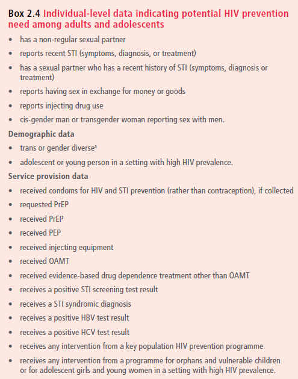

The following program indicators are calculated to provide denominators for the relevant coverage WHO indicators.

| UID         | DHIS2 Name                                                   |
| ----------- | ------------------------------------------------------------ |
| pbkiUBVI6jk | HIV PREV - HIV negative clients with substantial risk        |
| GCFreP95zUO | HIV PREV - Clients with substantial risk retested within 12 months after receiving a negative HIV test result, monthly |
| PLsp1dpY7jp | HIV PREV - HIV negative clients with substantial risk (last 12 months), monthly |
| aaRiVYd3Nqg | HIV PREV - Clients with substantial risk retested after receiving a negative HIV test result, yearly |

#### Notable program indicator configuration

**PRV.6 PEP completion**

The denominator is a program indicator of type EVENT in which we need to count all the clients that are due to finish their course of PEP, based on the assigned DE value ‘HIV - PEP: Due date’ [P9mYEN2N9wB].

**PRV.7 HIV in PEP recipients**

The numerator is a program indicator of type EVENT in which we count the number of clients that have received a positive HIV result within the three months after the last PEP initiation, based on the assigned DE value for ‘HIV - PEP: Last PEP initiation date’ [ju1A4XKItfG].

**PRV.9 Regular NSP (Needle-Syringe Programme) access**

The numerator is a program indicator of type EVENT in which we count the number of clients regularly accessing (within 30 days from a visit to another one) an NSP service. The numerator is based on the assigned value of the Boolean (Y/N) data element ‘HIV - NSP: Regular access’ [wuzgcIPtyzn], which captures the number of events where days between the current visit and previous visit is less than 30 days.

**PRV.11 OAMT(Opioid agonist maintenance treatment) coverage**

The WHO indicator definition states that the indicator reports the “Proportion of opioid dependent people receiving OAMT at a specific date”. The “specific date” used in the calculation of the numerator is ;therefore the information that this indicator will provide will be up to today.

A client is considered as an opioid dependent person if they have been clinically assessed as being opioid dependent or if they are in OAMT.

**PRV.13 OAMT minimum duration**

The denominator definition states that the program indicator should count the “Number of people starting OAMT during defined cohort recruitment period”. The “cohort recruitment period” has been set-up as the “last 12 months” for both denominator and numerator (see more on period boundaries in the section on **Implementation Considerations & Local Adaptation**)

The numerator states that the program indicator should count the “Number of people in the cohort retained in OAMT for at least six months”. This is configured as a count of ENROLLMENTS, where the assigned value to the hidden data element ‘HIV - OAMT: Cumulative days’ [YL74GURXFMz] is greater than or equal to 180/ 

**STI.8 Repeat diagnosis of STI syndrome**

The reporting period of the indicator has been set-up as the “last 12 months” therefore the output will be the proportion of clients diagnosed with a particular STI syndrome two or more times within the last 12 months.

In the numerator we need to calculate the number of people attending HIV prevention services diagnosed with a particular STI syndrome two or more times. This filter relies on the hidden data elements assigned with values for ‘last diagnosis date’:

- HIV - STI: Urethral discharge syndrome last diagnosis date [DI8O2sFAjIZ]
- HIV - STI: Vaginal discharge syndrome last diagnosis date [PMYnHPcLOrg]
- HIV - STI: Lower abdominal pain last diagnosis date [fGg6Qx8AzDw]
- HIV - STI: Genital ulcer disease syndrome last diagnosis date [Nxjc5ElxwEj]
- HIV - STI: Anorectal discharge last diagnosis date [bEFauzOj4ov]

In case there is the need to add/delete any STI syndrome according to the implementation needs, the data model needs to be replicated for additional STI diagnosis; or removed from PI calculations for STI diagnoses not relevant.

**HTS. 7 HTS linkage to prevention**

In the denominator, only the clients HIV negative deemed at elevated risk for HIV acquisition should be counted (see substantial risk classification) and it refers to all clients tested for HIV in the last 12 months.

In the numerator we count all clients that have received any HIV prevention activities within seven days from the HIV negative test result. The days of receiving any HIV prevention activity is considered as the visit date (EVENT_DATE). The program indicator uses the assigned valyue of the Data Element ‘HIV - HIV test: Date of last HIV test’ [LhZ48Bjj6RD]. 

**HTS. 8 HIV retesting coverage**

In the denominator, only the clients HIV negative and deemed at elevated risk for HIV acquisition should be counted (see substantial risk classification) and it refers to all clients tested in the last 12 months.

In the numerator we are counting all clients that have received another HIV test (independently from the result) within 12 months from the HIV negative test result. This program indicator uses the calculated value of the data element ‘HIV - HIV test: Date of last HIV test’ [LhZ48Bjj6RD].

## Metadata mapping & data exchange

As described above, all the dashboards and indicators are supported by an aggregate data model. This allows for mixed methods of reporting from various electronic and paper-based sources, enabling all data to be brought together for the purpose of analysis and use such as in an integrated HMIS.

Where target aggregate data elements can be populated by aggregating the underlying Tracker data from the HIV Prevention tracker, we have pre-configured a set of program indicators and included the mapping of the target aggregate dimensions (data element UID and Category Option Combination UID).

See [DHIS2 User documentation on how to use the Data Exchange App](https://docs.dhis2.org/en/use/user-guides/dhis-core-version-240/exchanging-data/data-exchange.html).

See [DHIS2 Developer documentation on the DHIS2 APIs for aggregate data exchange](https://docs.dhis2.org/en/develop/using-the-api/dhis-core-version-240/data-exchange.html?h=aggregate+data+exchange+2.40#create-aggregate-data-exchange) for more information.

The metadata has been aligned to the data dictionaries and indicator references published in the WHO’s Digital adaptation kit (DAK) for HIV, second edition (see Web Annex A of the digital adaptation kit for the data dictionary). Note that the Tracker not designed to support all aspects of clinical care guidelines and case management, some of which is contained in the HIV DAK, nor to replace robust facility EMRs; however, data from EMRs can be consumed into the national HIV registry for analysis and use.

You can find a detailed mapping between the DHIS2 metadata and the HIV DAK data dictionary in [this resource file](resources/files/Data_Exchange_mapping.xlsx)

## User Groups

| User group            | Metadata          | Data                 |
|-----------------------|-------------------|----------------------|
| HIV PREV - Admin        | Can edit and view | No Access            |
| HIV PREV - Access       | Can view only     | Can view only        |
| HIV PREV - Data capture | Can view only     | Can capture and view |

## Implementation Considerations & Local Adaptation

This chapter describes some of the possibilities for adapting the configuration for local context and needs, as well as implementation considerations that are important for the HIV prevention use case.

### Data Privacy & Confidentiality

Collecting data on key populations poses certain challenges, particularly when information is linked or shared across service providers and programmes. All individual-level health data, including those of key populations, must be classified as sensitive personal data, or personally identifiable information, that require a high standard of safety and security. All health information systems must have robust data security and confidentiality protocols in place to safeguard data, supported by laws and policies that protect health information. The processing of personal health data must address cybersecurity, trust building, accountability and governance, ethics, equity, capacity building and digital literacy.

Where safety and the potential to discourage access to services are a concern, the routine collection of key population information is not advised; and should be removed from the digitized DHIS2 Prevention Tracker Program. Similarly, before capturing personally identifiable data such as client name, birth date and other indirectly identifiable data, a risk assessment and security review of the electronic systems and SOPs for all users must be reviewed and gaps addressed. 

### Tracker structure adaptation

The HIV Prevention tracker structure is mostly a flat structure with only one main repeatable stage to record activities for any type of prevention visit. This intentionally simplified structure allows for increased flexibility for local adaptation and customization. For example:

- Sections can be easily translated in stages in case different user have to entered different information (as detailed previously the HIV Prevention service are very transversal and can have several actors involved on the distribution of the services)
- Reduced amount of program rules and well identified by the section targeted
- If a specific activity (prevention intervention, such as VMMC) is not relevant to your country’s package of HIV Prevention services offered, you can simply remove an entire sections without repercussions on the rest of the data model.

#### Integration of HIV Case Surveillance and HIV Prevention tracker

Depending on local context, some implementations may wish to integrate prevention and case surveillance into a single DHIS2 Tracker Program. An integrated tracker design option was considered for the global design guide, but ultimately discarded in favor of two Tracker programs for the following reasons:

1. Scale: the number of persons (TEIs) enrolled in a prevention program is likely to be much, much greater than the number of persons (TEIs) diagnosed as positive and enrolled in a Case Surveillance program. This may have an impact on performance and also requires adequate server infrastructure for large-scale Tracker deployment.
2. Types of service providers: in many country contexts, a large scale and variety of service providers may be engaged in HIV prevention services, such as community health workers, NGOs/CSOs as implementing partners, etc. Often these prevention service providers are not responsible for following up the HIV case through lifelong treatment and should not have access to the client’s health data after being identified as an HIV positive client. Therefore, separating the Tracker programs suits the variety and helps to ensure protection & data confidentiality of people living with HIV.
3. Indicators included in the WHO SI guidelines and DAK do not necessitate ‘cross-program’ analysis; all indicators can be generated within DHIS2 using two separate programs.
4. A typical workflow from prevention services to HIV case surveillance is well supported by closing the enrollment in a DHIS2 prevention tracker program and opening a new enrollment in the case surveillance program. The person (TEI) is linked to both Prevention and Case Surveillance programs in case ad hoc analysis will be required for advanced programmatic data analysis conducted outside of DHIS2.

An integrated design can be implemented leveraging many of the existing DHIS2 metadata, such as the Tracker data element library. Both Tracker programs follow a similar structure with initial case report and integrated, repeatable ‘visit’ stage for all follow-up thereafter.

Tracker metadata that are common between the HIV prevention and HIV case surveillance trackers are shared between the two programs (using the same UIDs) as follows:

- All Tracked Entity Attributes: all the TEAs are the same
- Initial case report: the Data Elements related to the Key population identification are the same
- Visit stage:
  - STI data elements are the same
  - Viral hepatitis: Data Elements related to the testing, date and result are the same

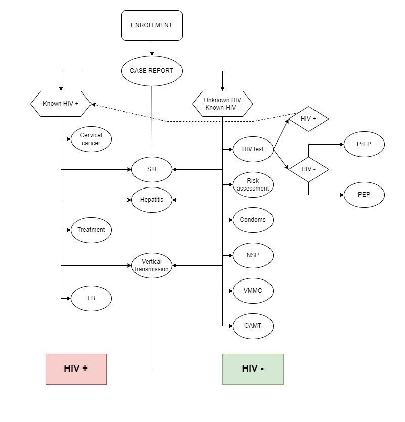

### Analytics & Indicator Calculations

#### Ownership Analytics

From DHIS2 v40, new functionality is available that allows for program indicator calculations to be made based on the ‘ownership’ org unit of a given enrollment. For example, you can count the number of unique clients that are receiving HIV prevention services at a facility even if they were not originally enrolled in care at that facility or officially transferred.

Program indicators can define which **organisation unit dimension** to be used in analytics. Choices include the organisation unit for the event, enrollment, registration, organisation unit data element and tracked entity instance ownership at the start or end of the reporting period. Ownership analytics apply only to program indicators configured *based on enrollment*.

More detailed guidance about Ownership Analytics can be found in the [Tracker Design Guide](https://docs.dhis2.org/en/implement/database-design/tracker-system-design/tracker-analytics.html#common-challenge-3-transfers-and-ownership).

>**Note:**
>
>for implementations using DHIS2 software version 2.39 or lower, program indicators generated at any level below national will not reflect the current ‘ownership’ org unit. This means that if a TEI (person) who has been permanently transferred from one organisation unit (Health Facility A) to another (Health Facility B) for a given Tracker program enrollment *will still be counted as belonging to Health Facility A* for the purposes of program indicators. In practical terms, this means that when a patient has moved between sites, all longitudinal indicators for this patient are not re-assigned to the patient’s latest site, and remain assigned to the initial site where the patient first entered the program. This is a critical limitation for typical HIV use cases, where site level performance metrics such as lost-to-follow-up must be generated accurately at a subnational or facility level. If your implementation uses DHIS2 v2.39 or lower, please review your configuration carefully to see if you have accounted for the exclusion of persons ‘transferred out’ based on the org unit enrollment ownership.

#### Event date vs Custom date

As previously described, a set of dates are requested for all these activities that can be carried out beyond an HIV prevention service but which information is still relevant for a comprehensive, person-centred management and reporting system.

The large majority of Program Indicators use this date in both period boundaries (as CUSTOM date) and/or in the filter. In case the implementation decide to use the event date (‘visit date’) as the default date for any of the activities, this will need to be reflected as well on the Program indicators

#### Tracker Data Analysis

For authorized users with access to personally identifiable data captured through the HIV Prevention tracker program, additional ad hoc analysis of tracker data can be achieved using the Line-list app and configuring working lists as part of the DHIS2 tracker program (note: only for users that have access to the Capture app for data collection).

In general, it is recommended to serve routine analytics for program monitoring through the aggregate data model, using program indicators and data exchange services, as implemented in this design. In part, this is because the aggregate data model in DHIS2 provides optimised dimensionality for analysis (e.g. the ability to slice and filter by Categories & CatCombos in Data Visualizer app). This also allows for more performant analytics, as running queries on large databases containing years worth of individual data can create unnecessary stress on the server.

Ad hoc analyses and individual level mining is typically restricted only to authorised public health users (such as HIV programme data managers) for advanced analyses; and users at the service delivery point (facility) for conducting operational follow up activities, contacting clients, or performing basic routine data quality checks & analyses on the individual level data they are responsible for collecting.

### Operationalizing variables for key populations

Some countries have experienced difficulties defining whether people seeking services belong to a given key population, considering that disclosure may put them at risk for discrimination, stigmatization and, in certain contexts, legal punity.

To facilitate the operationalization of key population definitions, the following table from the “[Framework for Monitoring HIV/STI Services for Key Populations in Latin America and the Caribbean](https://www.paho.org/en/documents/framework-monitoring-hivsti-services-key-populations-latin-america-and-caribbean-2019)” offers a sensitive and specific tool to standardise the collection of information through a minimum set of variables which allows for the categorization of persons into key population groups. This tool can be integrated into the DHIS2 Prevention Tracker by configuring an additional set of data elements that follow the structure of the questionnaire:

According to the data collected from the questionnaire, the client can be identified in one or more groups due to the overlapping practices and vulnerabilities. A country may have other key population and definitions; therefore, it is expected that the tool should be adapted according to the national context. The assignment of a person to a given key population group can be achieved using program rules to assign a value to the core data elements for Key Population groups included in the DHIs2 prevention tracker metadata.

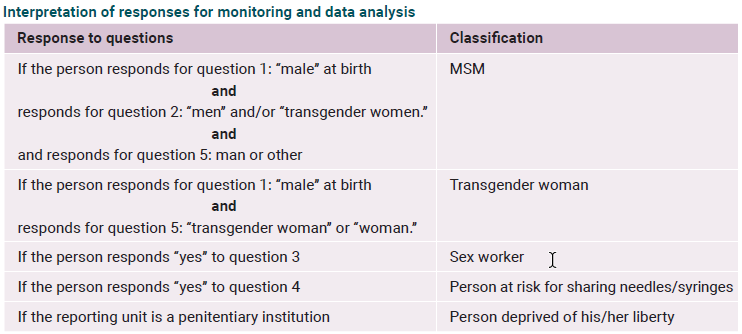

### Condom distribution

Opportunistic condom distribution including distribution campaigns are common interventions in many countries and this type of information can be largely under reported due to its extension. In addition, condom distribution can occur through many outlets such as private non-health care related settings like groceries and bodegas which are unlikely to report into MOH data systems.

Several implementations have decided to remove this section from the Tracker program and record aggregated numbers for condom distribution. The only WHO indicator requesting information on condoms distributed is PRV.1 *Condoms distributed* which requires three disaggregations that are easily implementable in an aggregate data model.

## References

WHO (2022). Consolidated guidelines on person-centred HIV strategic information: strengthening routine data for impact [https://www.who.int/publications/i/item/9789240055315](https://www.who.int/publications/i/item/9789240055315)

UNAIDS (2022) IN DANGER: UNAIDS Global AIDS Update 2022. Geneva: Joint United Nations Programme on HIV/ AIDS [https://www.unaids.org/en/resources/documents/2022/in-danger-global-aids-update](https://www.unaids.org/en/resources/documents/2022/in-danger-global-aids-update)
